# FitFindr — How Everything Works

This is just for you. Plain language, no jargon. If something still doesn't
make sense after reading, that's on the explanation not on you.

---

## 1. What Does This Project Actually Do?

You type something like `"vintage graphic tee under $30, size M"` and the
agent figures out what to buy, how to wear it, and gives you a caption to post.

Three steps, three answers. That's it.

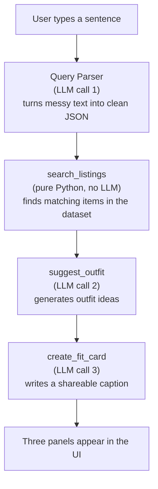

---

## 2. The Files and What They Do

Think of this like a kitchen. The tools are the knives and pans. The agent is
the chef who decides what to use and when. The app is the restaurant that
shows the food to the customer.

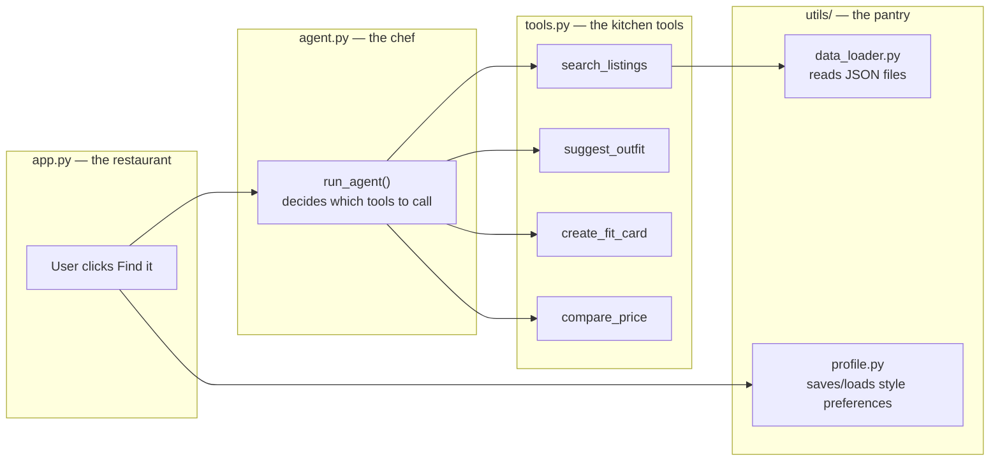

One rule to remember: `tools.py` has no idea that `agent.py` or `app.py` exist.
It's just a collection of functions you can call from anywhere. That's why you
can test each tool on its own without running the whole app.

---

## 3. The Session Dict — The Shared Notepad

This is the most important concept in the whole project so read this carefully.

When a user submits a query, `run_agent()` creates one Python dictionary called
`session`. Every single step of the agent reads from it and writes back into it.
It's the shared memory for the whole interaction.

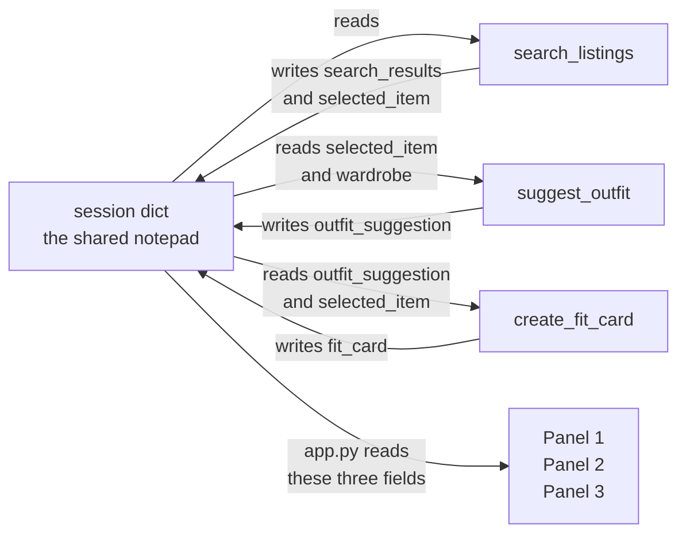

Here is what the session looks like at the end of a successful run:

```python
session = {
    "query":             "vintage graphic tee under $30",
    "parsed":            {"description": "vintage graphic tee",
                          "size": None,
                          "max_price": 30.0,
                          "in_scope": True},
    "search_results":    [ ...list of matching listings... ],
    "selected_item":     { ...the top listing... },   # this is results[0]
    "wardrobe":          { ...the user's wardrobe... },
    "outfit_suggestion": "Pair it with your baggy jeans and combat boots...",
    "fit_card":          "just thrifted this faded tee for $18...",
    "error":             None,       # None means everything worked
    "loosened":          None,       # explained in Stretch 1 section
    "price_check":       {"verdict": "good deal", ...},
}
```

`session["error"]` is the most important field. If it's `None`, everything worked.
If it's a string, something failed and `app.py` shows that string in Panel 1
instead of a listing.

---

## 4. The Planning Loop — What Actually Runs

`run_agent()` is NOT just "call all three tools one by one no matter what."
It checks the result of each step and either continues or stops early with an error.

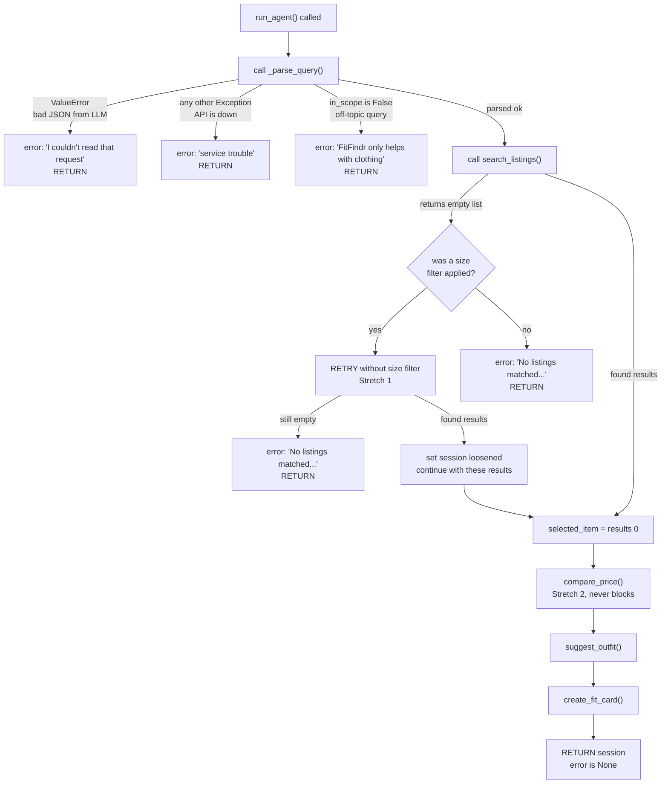

The three early exits at the top are why the agent never crashes or calls tools
with bad input. If search returns nothing, `suggest_outfit` never gets called.
Period.

---

## 5. How search_listings Finds Things

This one has no LLM. It's pure Python filtering over a local JSON file.
Here's the logic for `"vintage graphic tee"`, size `"M"`, max price `$30`:

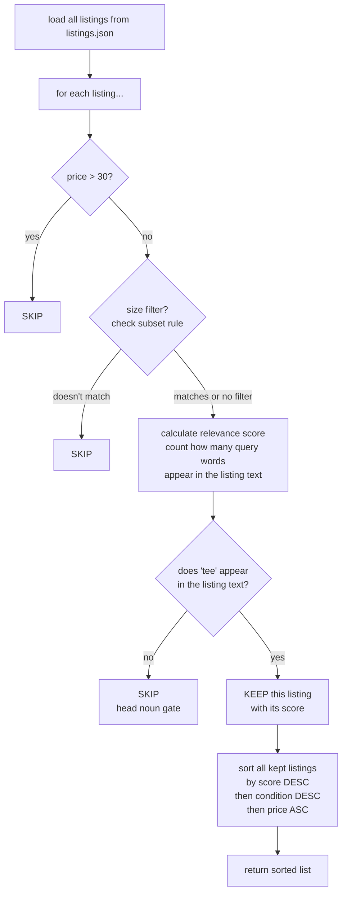

**The subset rule for sizes:** this is a subtle thing that matters.

The user wants size `"M"`. That gets turned into the token set `{"m"}`.
A listing sized `"S/M"` becomes `{"s", "m"}`.
Is `{"m"}` a subset of `{"s", "m"}`? Yes. So it matches.

But for shoes: user wants `"US 8"` which becomes `{"us", "8"}`.
A listing sized `"US 8.5"` becomes `{"us", "8.5"}`.
Is `{"us", "8"}` a subset of `{"us", "8.5"}`? No, because `"8" != "8.5"`. Correct.

If the rule was "any token matches" instead of "all tokens must match", then
`"US 8"` would match `"US 8.5"` because they both have `"us"`. That's wrong.

**The head noun:** the last word of the description after removing stopwords.
`"vintage graphic tee"` has head noun `"tee"`.
A listing must contain the word `"tee"` or it gets rejected entirely even if
its score is high. This stops a "vintage" boots listing from showing up.

---

## 6. How suggest_outfit Works

This tool has two completely different modes depending on whether you have
wardrobe items or not.

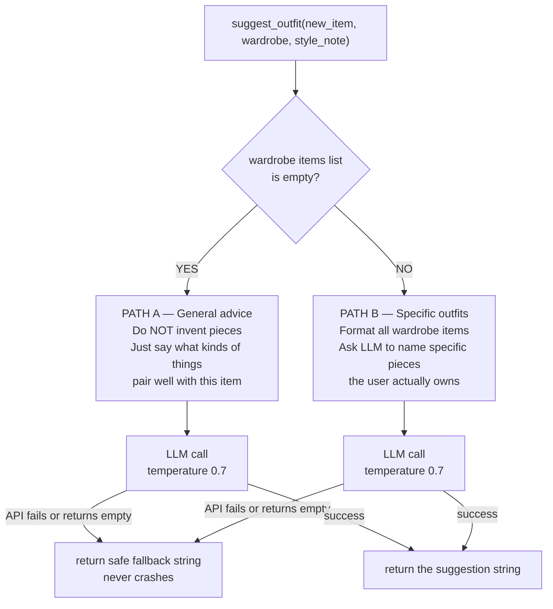

Temperature 0.7 means "moderately creative." The LLM gives different answers
each run but stays on-topic. It won't start talking about pizza.

---

## 7. How create_fit_card Works

Takes the outfit string and the listing, writes a casual caption.
The most important thing here is the empty-outfit guard at the top.

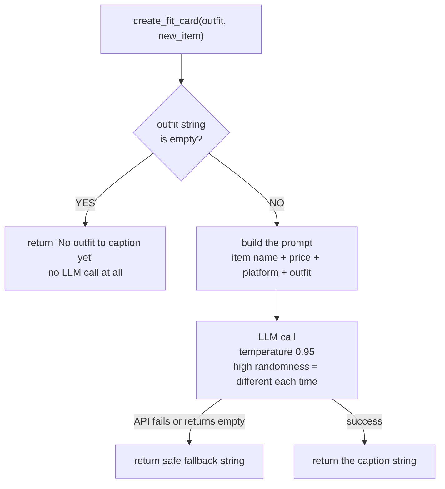

Temperature 0.95 is much higher than the outfit tool. That's on purpose.
The fit card should sound fresh and different every time you run it. Lower
temperature would make every caption start sounding the same.

---

## 8. The Query Parser — Why It Exists

Users type messy sentences. Tools need clean structured data. The parser is
the translator between those two worlds. It's an LLM call that always returns
valid JSON because we use Groq's "JSON mode."

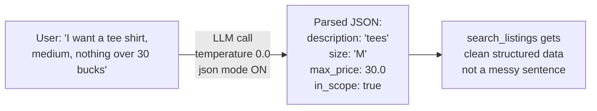

`in_scope` is the off-topic filter. If someone asks "what's the weather?" the
parser returns `in_scope: false` and the agent politely declines before wasting
any API calls on styling tools.

Temperature 0.0 means fully deterministic. The parser should always give the
same output for the same input. We don't want creative parsing.

---

## 9. compare_price — The Price Check

Compares the item's price against the median price of all other listings
in the same category.

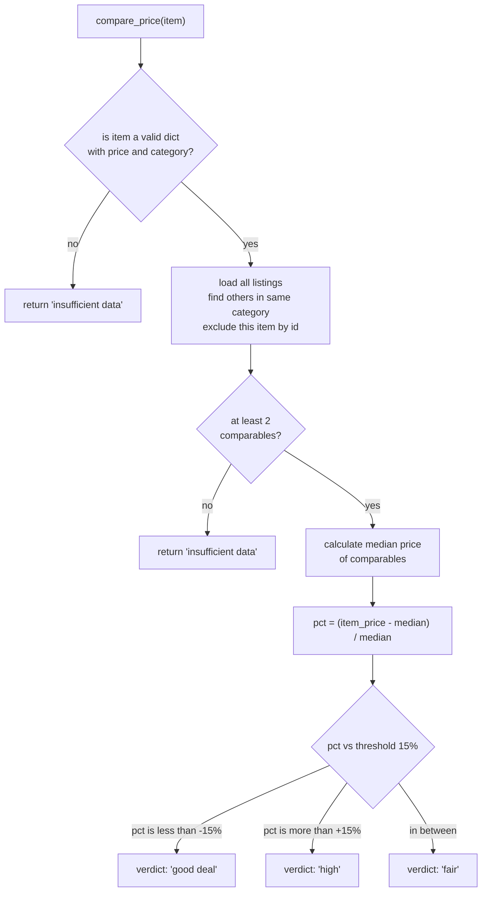

Why median and not average? Say one listing in "tops" is a $500 designer piece.
That would drag the average way up and make everything look like a good deal.
Median ignores outliers. It just gives you the middle value.

This tool never blocks the flow. Even if it returns "insufficient data", the
agent keeps going and generates the outfit suggestion anyway.

---

## 10. How Gradio Connects Python to the Browser

Gradio builds a web page for you from pure Python. No HTML, no JavaScript.
You just define inputs and outputs and wire a function to a button.

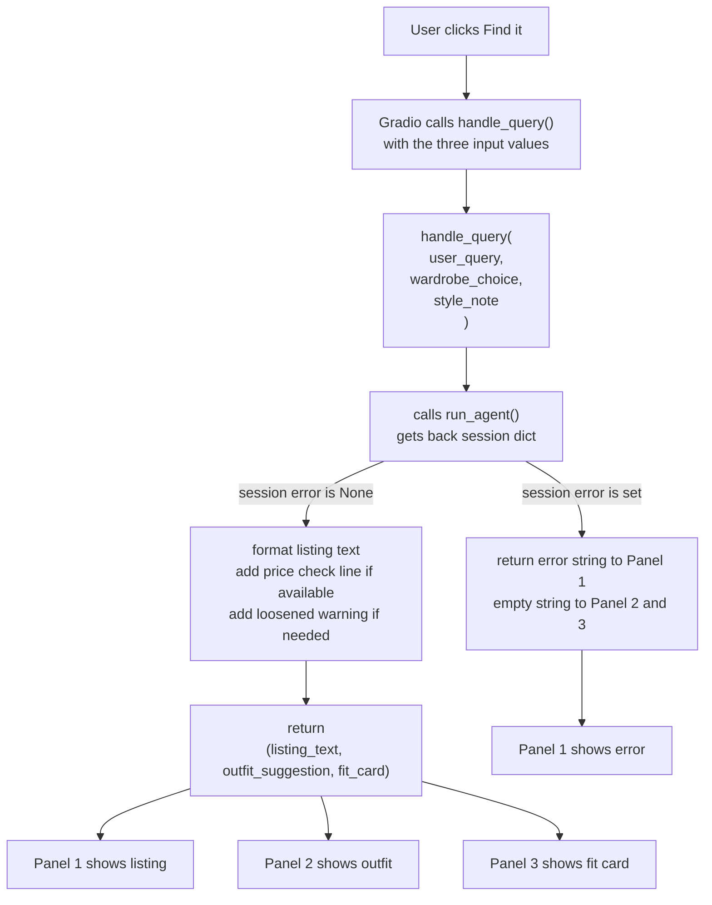

When you return a tuple of three strings from `handle_query()`, Gradio knows
to put the first string in Panel 1, second in Panel 2, third in Panel 3.
That wiring is set up at the bottom of `app.py` with `.click()`.

---

## 11. Error Handling — Every Way Things Can Break

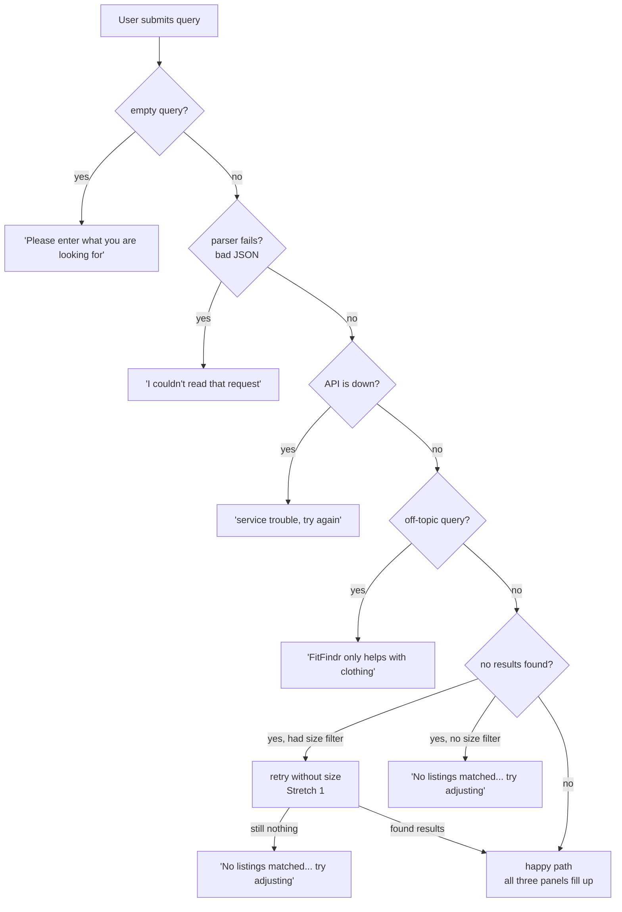

Nothing crashes. Every failure returns a helpful message that tells the user
what went wrong and what to try instead.

---

## 12. How Tests Work Without Calling the API

Every test in this project runs fully offline. No Groq API key needed.
The trick is called monkeypatching.

`_chat()` in `tools.py` is the one function that actually calls Groq.
In tests, we swap it out for a fake function that just returns a hardcoded string.

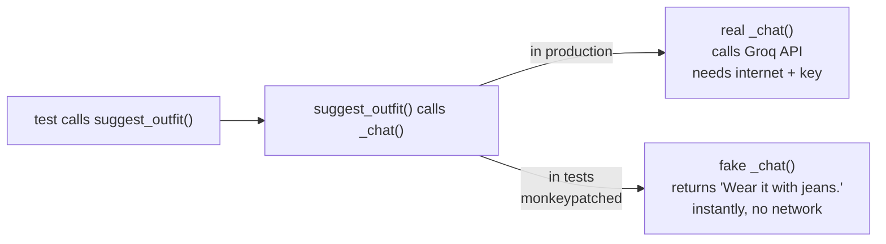

```python
# How monkeypatching looks in a test:
def test_suggest_outfit_returns_string(monkeypatch):
    monkeypatch.setattr(tools, "_chat", lambda *args, **kwargs: "Wear it with jeans.")
    result = suggest_outfit(some_item, some_wardrobe)
    assert isinstance(result, str)
    assert result == "Wear it with jeans."
```

`monkeypatch.setattr(tools, "_chat", fake_function)` temporarily replaces
the real `_chat` with the fake one just for that one test. After the test
finishes, it automatically gets put back. Clean, isolated, fast.

This is why `_chat` was kept as a thin, dumb wrapper with no extra logic inside
it. The simpler the function, the easier it is to replace in tests.

---

## 13. The Stretch Features

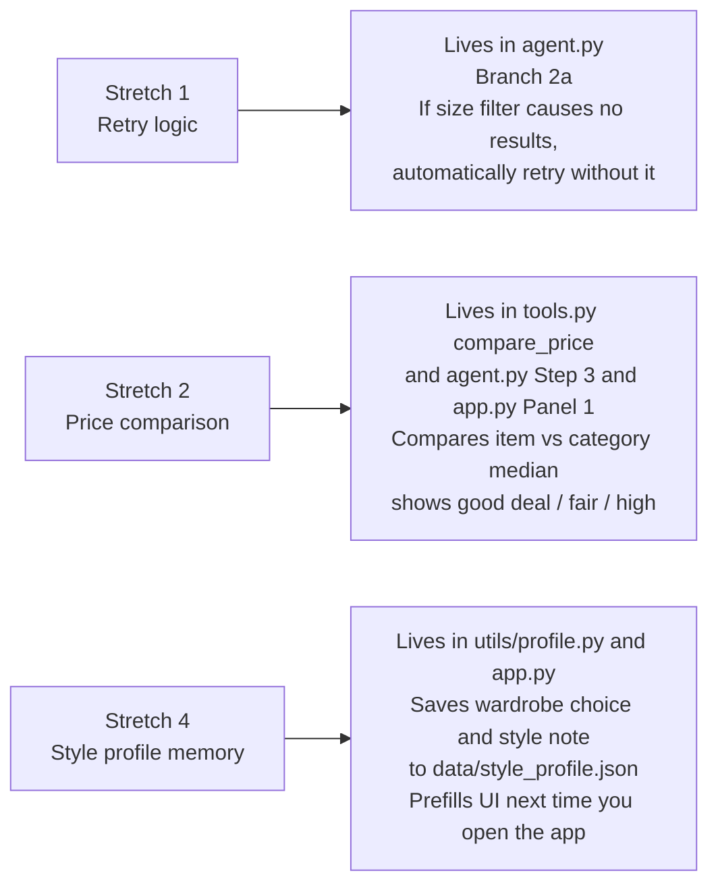

---

## 14. One Full Run From Start to Finish

Query: `"vintage graphic tee under $30"`, Example wardrobe, style note `"I like y2k"`

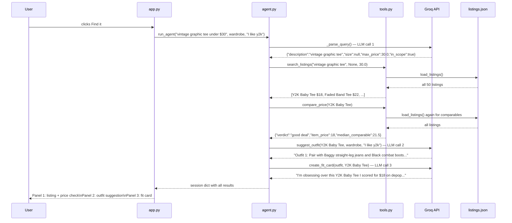

Total LLM calls per run: 3 (parser + outfit + fit card).
`search_listings` and `compare_price` are pure Python — no LLM calls.

---

That's everything. If you re-read sections 3, 4, and 5 you'll understand 80%
of how the project works. The rest is just details on top of those three ideas.
