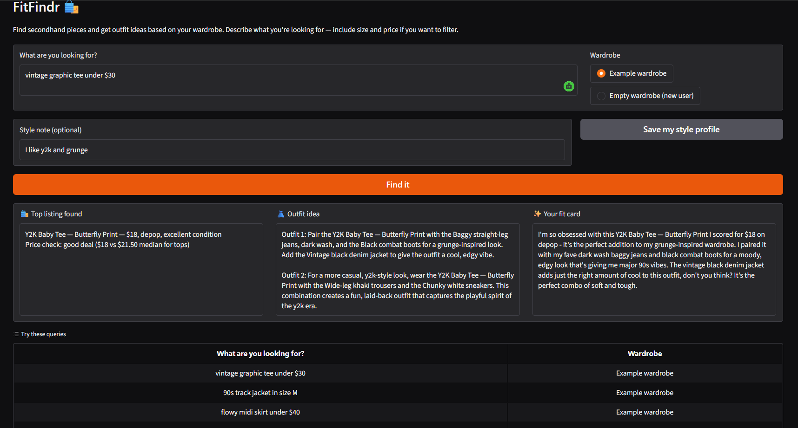
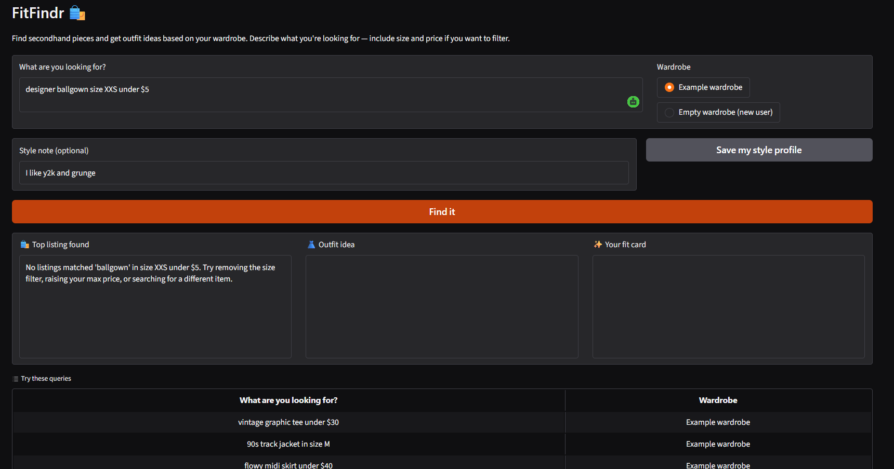
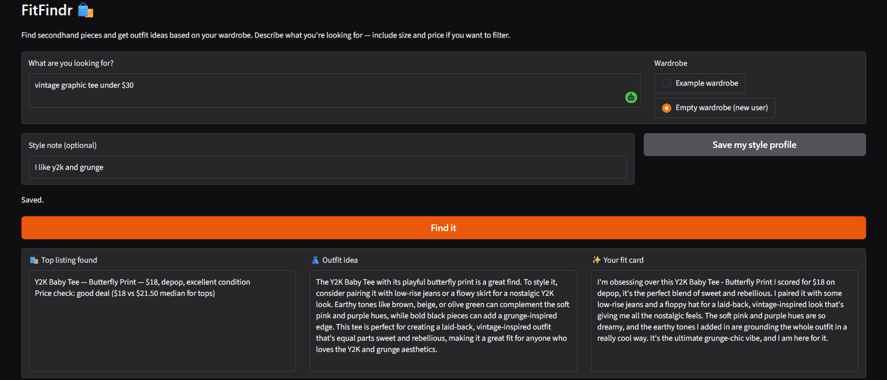
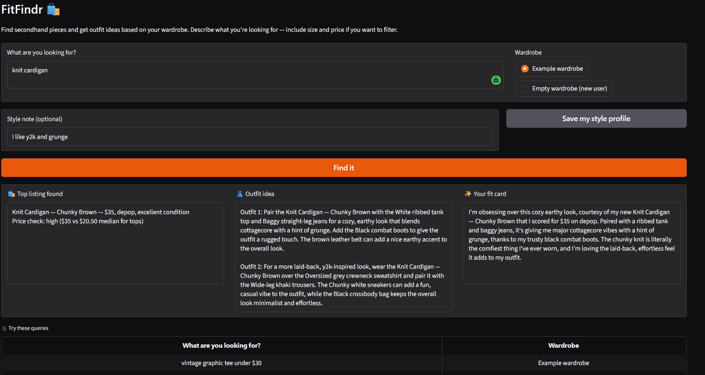
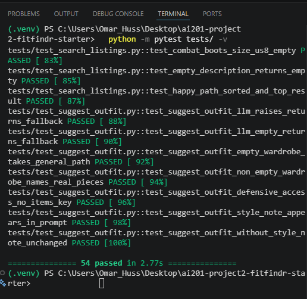

# FitFindr

**Demo video:** https://www.loom.com/share/58b1ec246f00410ca0b68995eb34e9fe

FitFindr takes a natural-language thrifting request and orchestrates three tools in
response to it. A user query triggers `search_listings`, which filters the mock dataset by
description, size, and price and returns matching items; the top match flows into
`suggest_outfit`, which uses the user's wardrobe to propose how to wear it; that suggestion
flows into `create_fit_card`, which writes a short shareable caption. If `search_listings`
finds nothing, the agent tells the user what to adjust and stops — it does not call the
later tools with empty input.

## Setup

1. Fork and clone this repo.
2. Create and activate a virtual environment:
   ```bash
   python -m venv .venv
   source .venv/Scripts/activate      # Windows (Git Bash)
   # or: .venv\Scripts\activate       # Windows (Command Prompt)
   # source .venv/bin/activate        # Mac/Linux
   ```
3. Install dependencies:
   ```bash
   pip install -r requirements.txt
   ```
4. Create a `.env` file in the repo root with your Groq key (same free key as Project 1,
   no credit card needed at [console.groq.com](https://console.groq.com)):
   ```
   GROQ_API_KEY=your_key_here
   ```
5. Run it:
   ```bash
   python app.py
   ```
   and open the URL it prints. It's usually `http://localhost:7860`, but check your
   terminal — the port can differ if something else is already bound to it.

To run the test suite, `pytest tests/` is enough — no API key required. Every LLM call in
the tests is monkeypatched at `tools._chat`, so the whole offline suite runs without
touching the network.

## The tools

I built three required tools plus one more LLM component the loop depends on. All four
live across `tools.py` (the three tools) and `agent.py` (`_parse_query`).

**`search_listings(description: str, size: str | None, max_price: float | None) -> list[dict]`**
Filters the mock listings dataset to items matching the description keywords, an optional
size, and an optional price ceiling, ranked by keyword relevance. It's a pure function over
local JSON — no LLM, no network — and it never raises; if nothing matches it returns `[]`.

**`suggest_outfit(new_item: dict, wardrobe: dict) -> str`**
Given a thrifted item (a listing dict) and the user's wardrobe, asks the LLM to propose 1–2
complete outfits. If the wardrobe has items, it names them specifically; if the wardrobe is
empty, it gives general styling advice instead of inventing pieces the user doesn't own.
Always returns a non-empty string.

**`create_fit_card(outfit: str, new_item: dict) -> str`**
Turns the outfit suggestion plus the new item into a short, casual, shareable caption — the
kind of thing you'd post with an OOTD photo. Always returns a string, even on failure.

**`_parse_query(query: str) -> dict`** (in `agent.py`, not one of the 3 required tools, but
worth knowing about)
The 4th LLM call in the system. It turns the user's raw sentence into a structured JSON
contract — `{description, size, max_price, in_scope}` — that `search_listings` and the loop
consume. This is also where size gets normalized ("size 8" → "US 8") and where off-topic
input gets flagged via `in_scope`. `search_listings` never sees raw user text; it only sees
what the parser hands it.

## How the planning loop decides what to call

The loop in `run_agent()` (`agent.py`) is a deterministic pipeline, not a model choosing
which tool to call next — the LLM only runs inside the parser and the two styling tools. The
*order* of tool calls is fixed by data dependency (you can't style an item before you've
found one, and you can't caption an outfit before you've styled it). What actually varies is
the *branching*, and that's the part worth understanding:

- **Branch 1a (parse failure).** If the parser call raises or comes back as bad JSON /
  missing keys, the loop catches it, sets a "couldn't read that" error, and returns before
  touching any tool. I deliberately wrap only this call in try/except — a Groq service error
  is a different exception type than a JSON `ValueError`, so the loop can tell "I couldn't
  parse this" apart from "the service is down" and answer accordingly.
- **Branch 1b (scope gate).** The parser also returns `in_scope`. If it's false, the loop
  declines with a single warm redirect and returns — off-topic or distressing input never
  reaches the styling LLM at all.
- **Branch 2a (no results).** If `search_listings` comes back empty, the loop sets an error
  naming what was searched and what to loosen, and returns *without* calling
  `suggest_outfit`. This is the branch that actually proves the loop is reactive rather than
  a fixed sequence — give it a query for something not in the dataset and it visibly stops
  one tool early instead of running all three regardless.

If none of those fire, the loop runs straight through: search → pick the top result →
suggest an outfit → write the caption → return. The full diagram is in `planning.md` under
Architecture if you want to see it drawn out.

## State management

There's a single source of truth for the whole interaction: the `session` dict created by
`_new_session()`. No globals, no re-prompting the user mid-run. Every tool reads its inputs
from `session` and writes its result back into `session`.

The piece that matters most: `session["selected_item"]`, set once in Step 3 from
`search_results[0]`, is the *exact same dict* passed into both `suggest_outfit` and
`create_fit_card` — not a copy, not something reconstructed from a re-entered value. The
full key-by-key table of what's set when and read by what is in `planning.md` under State
Management.

## Error handling

Every tool owns its own failure mode — nothing in this system fails silently or crashes the
agent. A concrete example from my own testing, the no-results path on
`"designer ballgown size XXS under $5"`:

```
No listings matched 'ballgown' in size XXS under $5. Try removing the size filter,
raising your max price, or searching for a different item.
```

`fit_card` stayed `None` for that run, because the loop stops at branch 2a and never calls
`suggest_outfit` with an empty result.

The other failure modes, briefly:
- `create_fit_card` guards against an empty `outfit` string up front and returns "No outfit
  to caption yet — generate a styling idea first." without ever calling the LLM.
- `suggest_outfit` treats an empty wardrobe as a fallback path, not an error — it returns
  general styling advice instead of inventing wardrobe pieces.
- Both LLM tools catch their own API/timeout errors and return a safe fallback string rather
  than propagating the exception.

The full table, with every failure mode and the exact agent response, is in `planning.md`
under Error Handling.

## Screenshots

**Happy path — full 3-tool flow (Example wardrobe + style note)**
The search returns a Y2K Baby Tee at $18 from Depop. The price check shows it's a good deal ($18 vs $21.50 median for tops). The outfit suggestion names specific wardrobe pieces (baggy jeans, combat boots, vintage denim jacket). The fit card is a casual caption that sounds like a real post.



**Error path — no results (Branch 2a)**
`"designer ballgown size XXS under $5"` matches nothing in the dataset. The agent tells the user exactly what was searched and what to try instead. The Outfit idea and Your fit card panels stay empty — `suggest_outfit` was never called.



**Empty wardrobe + style profile memory (Stretch 4)**
With no wardrobe items, `suggest_outfit` gives general styling advice instead of inventing pieces. The style note ("I like y2k and grunge") was saved via the Save my style profile button and persists across sessions.



**Price check — "high" verdict (Stretch 2)**
`"knit cardigan"` finds the Chunky Brown Knit Cardigan at $35. The price check compares it against the category median ($20.50 for tops) and calls it high — surfaced in Panel 1 without blocking the rest of the flow.



**Test suite — 54 tests passing**
All tools, the planning loop, and all stretch features are covered. Every LLM call is monkeypatched at `tools._chat` so the full suite runs offline in under 3 seconds.



## Spec reflection

Writing the full tool/loop/state spec in `planning.md` before touching code paid off the way
it's supposed to: I could hand Claude Code one tool's spec block at a time and it built to my
design instead of guessing at one, and the isolation-test discipline — testing each tool
alone before wiring anything together — caught problems early instead of three tools deep
into a broken chain.

It also caught a mistake in the spec itself, not just in the code. My committed Tool 1 spec
originally said to keep a listing if *any* requested size token matched. My own isolation
test (asserting that searching "US 8" must exclude "US 8.5") failed against that rule,
because every US shoe size shares the "us" token — "any" was over-matching. I changed the
spec to a subset rule (*every* requested token must be present) before touching the
implementation, so the corrected spec and the code stayed in sync. The spec was a draft I
had to fix, not something I could treat as settled just because I'd written it down first.

## AI usage

Two specific instances worth recording:

**The size-rule fix.** I gave Claude Code my Tool 1 spec block to implement
`search_listings`. It implemented the size filter exactly as my spec said — "any token
matches." When I wrote the isolation test asserting "US 8" must not return "US 8.5", it
failed: "any" over-matched on the shared "us" token. I overrode my own spec, not the AI's
output — switched it to the subset rule (every token must be present) and committed the
corrected spec before regenerating the code. The bug was in what I'd specified, and the test
is what surfaced it.

**The mojibake override.** While speccing the LLM tools, Claude Code looked at a debug print
of a listing title, saw a `�` where an em dash should be, and proposed a sanitization step to
"repair" the supposedly double-encoded text. I checked the raw file myself before accepting
that — the data was valid UTF-8; the `�` was just my Windows console failing to render
`U+2014`. I rejected the proposed fix, since it would have corrupted clean data, and instead
locked in a do-not-sanitize decision (D6 in `planning.md`): all reads use
`encoding="utf-8"`, and the `�` is a console artifact you'll see in terminal output but never
in the Gradio UI. The AI's suggestion was confident and wrong, and the only way I caught that
was by going back to the source file instead of trusting the explanation.
