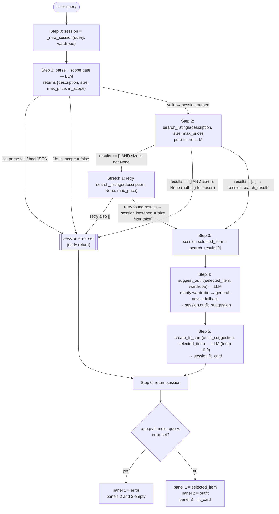

# FitFindr — planning.md

> Complete this document before writing any implementation code.
> Your spec and agent diagram are what you'll use to direct AI tools (Claude, Copilot, etc.) to generate your implementation — the more specific they are, the more useful the generated code will be.
> Your planning.md will be reviewed as part of your submission.
> Update it before starting any stretch features.

---

## Foundational Decisions (cross-cutting)

These constrain every tool and the planning loop. Locked in Batch 1.

**D1 — Query parsing is LLM-based, lives in `agent.py` Step 2.** One Groq call turns the
raw user sentence into a structured JSON contract that Tool 1 and the loop consume:

```json
{ "description": str, "size": str | null, "max_price": float | null, "in_scope": bool }
```

- `description` — a CLEAN keyword phrase with the **head noun last** (e.g. `"vintage graphic tee"`,
  `"combat boots"`). The parser normalizes plurals/synonyms to the form that exists in the
  data (plural item nouns; `"tee"` not `"t-shirt"`).
- `size` — a **NORMALIZED, data-form size label**: `medium`→`M`, `size 8`→`US 8`,
  `30 waist`→`W30`, or `null` if no size was mentioned. The parser is the single
  normalization layer for size. Tool 1 does pure token-equality matching and carries no
  synonym/stem/word-map logic.
- `max_price` — float ceiling, or `null`.
- `in_scope` — `true` if the request is a thrift/styling query, `false` otherwise.

The parser prompt is authored in M4 Phase A (when `_parse_query` is built), not earlier.
Because the parser carries the full precision of search, its verification must test
normalization output (right head noun, right size label), not just valid JSON — a silent
mis-normalization surfaces as a false no-results that the parse-failure guard below won't
catch. The parser uses Groq JSON mode (`response_format={"type": "json_object"}`) at
temperature ~0; bad JSON / missing keys / wrong types raise `ValueError` (→ 1a), while a
Groq service error propagates as its own type (→ the service-error message).

**D2 — Wardrobe source is whatever `run_agent` receives.** `app.py`'s radio passes
`get_example_wardrobe()` (normal path) or `get_empty_wardrobe()` (tests the empty-wardrobe
fallback in Tool 2). No change to the loaders.

**D3 — Return types (locked by the stubs):** `search_listings` → `list[dict]`,
`suggest_outfit` → `str`, `create_fit_card` → `str`.

**D4 — Session keys:** adopt `_new_session()` as-is. No-results, out-of-scope, and
parser-failure all use the existing `error` field + early return. No new keys.

**D5 — Input gate at the top of `run_agent`, driven by the parser's `in_scope` flag.**
If `in_scope` is `false` → set `error` to a brief, kind, on-topic-redirecting message and
return **before** `search_listings`. This is both the scope guard and a safety pre-filter:
clearly off-topic or distressing input is declined gently, never passed to the styling LLM.
Exact wording locked in Batch 3.

**Parser failure mode.** If the Groq parse call errors or returns non-JSON, the loop
catches it, sets `error` to a brief `"couldn't understand that — try naming an item, size,
or price"` message, and returns early — same shape as no-results and out-of-scope. The
agent never crashes and never passes garbage to `search_listings`. Wording locked in Batch 3.

**D6 — Data read discipline (no sanitization).** Listing titles are valid UTF-8 (the dash
is `U+2014` EM DASH, not corrupted bytes). All file reads use `encoding="utf-8"` —
`load_listings()` already does, so every consumer (Tool 1, Tools 2/3, `app.py`) receives
clean text. The `�` occasionally seen in Windows-terminal debug prints is a console
rendering artifact, not corrupted data, and does not appear in the Gradio UI. No
sanitization step is needed or wanted (a re-decode "repair" would corrupt the clean data).

---

## Tools

List every tool your agent will use. For each tool, fill in all four fields.
You must have at least 3 tools. The three required tools are listed — add any additional tools below them.

### Tool 1: search_listings

**What it does:** Filters the mock listings dataset to items matching the description
keywords, an optional size, and an optional price ceiling, ranked by keyword relevance.
Pure function over local JSON — no LLM, no network. Owns all size *matching* (but not
size *normalization* — see precondition).

**Precondition (contract):** `description` is a CLEAN keyword phrase with the head noun
last, and `size` is a NORMALIZED data-form label — both produced by the parser (D1). In
the real flow Tool 1 never sees raw user text, so messy inputs like `"combat boots in
black"` or `"jacket thats oversized"` are out-of-contract and won't reach it. Milestone 3
isolation tests therefore call Tool 1 with clean phrases (`"vintage graphic tee"`,
`"designer ballgown"`), not raw sentences.

**Input parameters:**
- `description` (str): clean keyword phrase, head noun last (e.g. `"vintage graphic tee"`,
  `"black combat boots"`). Drives relevance scoring. Colors live here as scored keywords —
  there is no color filter.
- `size` (str | None): normalized data-form size label (`"M"`, `"US 8"`, `"W30"`), or
  `None` to skip size filtering.
- `max_price` (float | None): inclusive price ceiling, or `None` to skip price filtering.

**What it returns:** `list[dict]` — matching listing dicts, each carrying all 11 original
fields (`id, title, description, category, style_tags, size, condition, price, colors,
brand, platform`), sorted by relevance descending. Empty list `[]` if nothing matches.
Never raises.

**Matching algorithm (apply in this exact order):**
1. Load via `load_listings()`.
2. **Hard filter — price:** keep if `max_price is None or listing["price"] <= max_price`.
3. **Hard filter — size:** if `None`, keep all. Else tokenize both the requested size and
   `listing["size"]` (split on `/`, whitespace, and parentheses → lowercased token set);
   keep if **every** requested token is present in the listing's token set, OR the listing
   is a `One Size` variant. Token-equality (subset), never substring. Examples: `US 8`
   (`{us, 8}`) matches only `US 8` — NOT `US 8.5` (`{us, 8.5}`), because the token `8` is
   absent there even though `us` is shared; `8` (`{8}`) likewise matches only `US 8`; `L`
   (`{l}`) matches `L`, `L/XL`, `M/L` (each contains the `l` token) but not `XL` or
   `W30 L30`. No stemming: `boot` ≠ `boots` by design (the parser emits the data form).
4. **Relevance score:** lowercase + tokenize `description`, drop trivial stopwords; build
   the listing's combined text from `title + description + style_tags + category + colors`
   (joined, lowercased); score = count of distinct query tokens present.
5. **Head-noun gate:** drop any listing where the head noun (last description token after
   stopword removal) is absent from the combined text, even if score > 0. This is a
   deliberate precision-over-recall choice: it makes the no-results path fire honestly for
   items absent from the dataset (`"midi skirt"`, `"combat boots"`), at the cost of dropping
   a semantically-correct item whose text lacks the exact head word (e.g. a `"Bomber"` with
   no `"jacket"` in its text).
6. Drop score-0. Sort survivors by score desc, then `CONDITION_RANK` desc
   (`{"excellent": 3, "good": 2, "fair": 1}`), then price asc. Return.

**What happens if it fails or returns nothing:** returns `[]` (this includes the
empty-description case — a keyword-less search is not a real search). The planning loop
treats `[]` as the no-results branch: it sets `session["error"]` and does NOT call
`suggest_outfit`. Tool 1 itself never raises.

---

### Tool 2: suggest_outfit

**What it does:** Given a thrifted item and the user's wardrobe, asks the LLM
(`llama-3.3-70b-versatile` via the provided `_get_groq_client()`) to propose 1–2 complete
outfits built around the new item. Names real wardrobe pieces when the wardrobe is
non-empty; gives general styling advice when it's empty.

**Precondition:** `new_item` is a valid listing dict from `search_listings` — the planning
loop guarantees this. An empty wardrobe is a fallback path, **not** an error.

**Input parameters:**
- `new_item` (dict): a full listing dict. The prompt uses `title`, `category`, `colors`,
  `style_tags`, `condition`; `brand` is optional (`None` in 32/40 listings — never
  reference it if absent).
- `wardrobe` (dict): `{"items": [...]}` (the empty wardrobe also carries a `_note` key, so
  access it as `wardrobe.get("items", [])` — never assume the dict has only `items`). Each
  item has `id, name, category, colors, style_tags, notes` (`notes` may be `null`).

**What it returns:** a non-empty `str`.
- Non-empty wardrobe → references specific wardrobe pieces **by name**, as readable prose
  with light `Outfit 1: / Outfit 2:` labels at most (no bullets, no JSON).
- Empty wardrobe → general styling guidance (what categories/colors/vibes pair well)
  without inventing pieces the user doesn't own.

**Internal branch:**
- `wardrobe["items"]` empty → general-styling prompt.
- Non-empty → pass the **whole wardrobe** (10 items is small enough; let the LLM choose),
  including `name + category + colors + style_tags + notes` per item. The `notes` carry
  fit signal ("Really oversized — drops below the hip", "High-waisted") that makes
  suggestions specific. Ask for 1–2 outfits naming real pieces.

**Generation knobs:** model `llama-3.3-70b-versatile`; moderate temperature (coherence
matters more than novelty here — variability is Tool 3's job, not this one); optional
`max_tokens` ceiling to keep the suggestion concise, since the fit card consumes it next.

**What happens if it fails or returns nothing:**
- Empty wardrobe → handled by the fallback branch above (not an error).
- LLM returns empty/whitespace → return a safe non-empty fallback string ("Couldn't
  generate a full styling idea for this one — but it's a versatile piece worth grabbing."),
  never `""`.
- LLM call raises (timeout/API error) → catch it, return a graceful fallback string, never
  propagate the exception.
- Item/wardrobe text is framed as descriptive data to style, never as instructions (the
  `in_scope` gate already filters off-topic input upstream).

---

### Tool 3: create_fit_card

**What it does:** Turns the outfit suggestion + the new item into a short, casual,
shareable caption — the kind of thing someone posts with an OOTD photo. Uses
`llama-3.3-70b-versatile` via the provided `_get_groq_client()`.

**Precondition:** in the live flow `outfit` is always non-empty, because `suggest_outfit`
returns a fallback string rather than `""`. The empty-`outfit` guard below therefore
exists for **Milestone 3 isolation tests and the Milestone 5 deliberate-failure trigger**
(`create_fit_card("", item)`), not the normal path — it is not dead code.

**Input parameters:**
- `outfit` (str): the suggestion string from `suggest_outfit`.
- `new_item` (dict): the listing dict. The caption mentions item `title`, `price`, and
  `platform` once each, naturally. `brand` may be `None` — never reference it if absent.

**What it returns:** a 2–4 sentence `str` caption that: feels authentic (not a product
description), mentions item name + price + platform once each, captures the outfit's vibe
in specific terms, and **varies across runs and inputs**.

**Formatting:** render price as `$22` (strip the trailing `.0`) and platform in casual
lowercase (`"depop"`), matching the reference voice ("thrifted this … off depop for $22 …").

**Generation knobs:** model `llama-3.3-70b-versatile`; temperature **0.9–1.0** and **no
fixed `seed`** (a fixed seed reproduces captions and fails the variability check regardless
of temperature); optional `max_tokens` ceiling to hold the 2–4 sentence target.

**What happens if it fails or returns nothing:**
- `outfit` empty/whitespace/missing → return a descriptive error **string** ("No outfit to
  caption yet — generate a styling idea first."); do **not** raise, do **not** call the LLM.
- LLM returns empty / raises → catch it and return the safe fallback caption string
  "Couldn't write a caption for this one right now — but it's a great find worth showing
  off.", never `""`, never propagate.
- `outfit`/item text is styled as content, never obeyed as instructions.

---

### Additional Tools (if any)

<!-- Copy the block above for any tools beyond the required three -->

---

## Planning Loop

**How does your agent decide which tool to call next?**

The loop is a deterministic pipeline with explicit early-return branches. The LLM is used
ONLY inside two places (the parse call and the two styling tools) — it never chooses which
tool to call. The order is fixed by data dependency (can't style an item before finding
it; can't caption an outfit before styling it); the BRANCHING is what changes behavior,
not the order. The steps below map 1:1 onto `run_agent()`'s TODO in `agent.py`, with a
numbering offset: **planning Step N = agent.py Step N+1** (the file numbers init as Step 1).

**Step 0 — initialize.** `session = _new_session(query, wardrobe)`.

**Step 1 — parse + scope gate (LLM call).** Send the raw query to the parser, which
returns JSON `{ description, size, max_price, in_scope }` per D1. Note `in_scope` is a
**4th key** in the parsed dict beyond the stub's description/size/max_price.
- BRANCH 1a — parse failure: if the call raises OR returns non-JSON / missing keys →
  set `session["error"]` to the parse-failure message (see error table) and RETURN.
  Never pass garbage downstream.
- BRANCH 1b — out of scope: if `in_scope` is false → set `session["error"]` to the
  out-of-scope / safety-redirect message and RETURN. The styling LLM never sees off-topic
  or distressing input.
- Else: store the parsed dict in `session["parsed"]` and continue.

**Step 2 — search (pure function).**
`results = search_listings(parsed["description"], parsed["size"], parsed["max_price"])`.
Store in `session["search_results"]`.
- BRANCH 2a — no results: if `results == []` → set `session["error"]` to the no-results
  message and RETURN. Do NOT call `suggest_outfit`. (This is THE branch the grader checks:
  the agent must behave differently here than on the happy path.)
- Else: continue.

**Step 3 — select.** `session["selected_item"] = session["search_results"][0]` (top
result; Tool 1 already sorted by relevance → condition → price).

**Step 4 — suggest outfit (LLM call).**
`suggestion = suggest_outfit(session["selected_item"], session["wardrobe"])`. Store in
`session["outfit_suggestion"]`. No early-return here: an empty wardrobe is a FALLBACK
inside the tool (general advice), not an error, and an LLM failure returns a fallback
string. The tool always returns a non-empty string, so the loop proceeds.

**Step 5 — fit card (LLM call).**
`card = create_fit_card(session["outfit_suggestion"], session["selected_item"])`. Store in
`session["fit_card"]`. No early-return: in the live flow `outfit_suggestion` is always
non-empty (Step 4 guarantees it), so the empty-outfit guard never fires here — it exists
for isolation tests / M5. An LLM failure returns a fallback string.

**Step 6 — return.** Return `session`. On success `error` is None and `outfit_suggestion`
+ `fit_card` are populated; on any early return `error` is set and the later fields stay None.

**Done condition:** the pipeline has no while-loop / retries — it runs once, top to bottom,
and terminates either at an early-return branch or after Step 6. (The stretch "retry with
loosened constraints" would add a loop around Step 2 later; not in the baseline.)

**Error-handling division (deliberate):** the loop wraps only the parser (Step 1) in
`try/except`. Tools 1–3 self-handle — Tool 1 never raises, Tools 2/3 catch their own LLM
errors and return fallback strings — so the loop trusts their contracts and does not wrap
Steps 2/4/5. One honest gap: a catastrophic `load_listings()` IO failure (e.g. data file
deleted) would propagate uncaught; acceptable, since the data is bundled with the repo.
The empty/whitespace-query guard lives in `app.py`'s `handle_query`, not in the loop.

---

## State Management

**How does information from one tool get passed to the next?**

Single source of truth: the `session` dict from `_new_session()`. No globals, no
re-prompting the user mid-run, no hardcoded values between steps — every tool reads its
inputs from `session` and writes its output back to `session`.

What's stored, when it's set, and what reads it next:

| Key | Set in | Value | Read by |
|-----|--------|-------|---------|
| `query` | Step 0 | raw user string | Step 1 parser |
| `wardrobe` | Step 0 | wardrobe dict (example or empty) | Step 4 `suggest_outfit` |
| `parsed` | Step 1 | `{description, size, max_price, in_scope}` | Step 2 `search_listings` |
| `search_results` | Step 2 | `list[dict]` of listings (may be `[]`) | Step 2 branch + Step 3 |
| `selected_item` | Step 3 | top listing dict | Steps 4 & 5 |
| `outfit_suggestion` | Step 4 | styling string | Step 5 `create_fit_card` |
| `fit_card` | Step 5 | caption string | `app.py` output panel |
| `error` | any early-return branch | message string (else `None`) | `app.py` — checked FIRST |
| `loosened` | Step 2 retry (Stretch 1) | short note e.g. `"size filter (M)"`, else `None` | `app.py` — prepended to the listing panel when set |

State-flow guarantee for the demo: the `selected_item` set in Step 3 is the EXACT dict
passed into both Step 4 and Step 5 — no re-entry, no reconstruction. This is what the demo
prints to show state passing. `app.py` reads `error` first; if set, it shows the error in
panel 1 and leaves the other two empty.

---

## Error Handling

For each tool, describe the specific failure mode you're handling and what the agent does
in response. Each response is specific and actionable — it names what failed and what the
user can do next. (The template's three required rows are present; the two parser rows are
added because the loop depends on them.)

| Tool / step | Failure mode | Agent response (specific + actionable) |
|-------------|--------------|----------------------------------------|
| parser (Step 1) | bad JSON / missing keys / wrong types (ValueError) | "I couldn't read that request — try naming an item, a size, or a price, e.g. 'vintage denim jacket size M under $40.'" → return early, no tools called |
| parser (Step 1) | Groq API / connection / timeout error (non-ValueError) | "FitFindr is having trouble reaching its service right now — please try again in a moment." → return early, no tools called |
| parser (Step 1) | `in_scope == false` (off-topic / distressing) | Single warm redirect: "FitFindr only helps find and style secondhand clothing. Tell me what you're after — for example, 'vintage denim jacket, size M, under $40' — and I'll dig something up." → return early. Distress-*specific* routing is out of baseline scope (the parser returns only `in_scope`, no distress flag); the safety property that DOES hold is that off-topic or distressing input is never passed to the styling LLM — it is declined with this single redirect. |
| search_listings (Step 2) | `results == []` | Name what was searched and what to loosen: "No listings matched 'X' in size Y under $Z. Try removing the size filter, raising the price, or searching a different item." → return early, `suggest_outfit` NOT called |
| suggest_outfit (Step 4) | wardrobe is empty | NOT an error — the tool returns general styling advice for the item (what pairs well, what vibe it suits) instead of naming owned pieces. Flow continues to the fit card. |
| suggest_outfit (Step 4) | LLM returns empty / raises | Tool returns a safe non-empty fallback ("Couldn't generate a full styling idea for this one — but it's a versatile piece worth grabbing."); flow continues, agent never crashes. |
| create_fit_card (Step 5) | `outfit` empty/missing (tests / M5 only) | Tool returns a descriptive error string ("No outfit to caption yet — generate a styling idea first."), does not call the LLM, does not raise. |
| create_fit_card (Step 5) | LLM returns empty / raises | Tool returns the safe fallback caption "Couldn't write a caption for this one right now — but it's a great find worth showing off."; flow completes. |

---

## Architecture



**SESSION** (single source of truth, `_new_session`): `query · parsed · search_results ·
selected_item · wardrobe · outfit_suggestion · fit_card · error`. Every tool reads its
inputs from `session` and writes its output back to `session`; the three error branches
(1a, 1b, 2a) all set `session.error` and short-circuit to the return.

---

## AI Tool Plan

<!-- For each part of the implementation below, describe:
     - Which AI tool you plan to use (Claude, Copilot, ChatGPT, etc.)
     - What you'll give it as input (which sections of this planning.md, your agent diagram)
     - What you expect it to produce
     - How you'll verify the output matches your spec before moving on

     "I'll use AI to help me code" is not a plan.
     "I'll give Claude my Tool 1 spec (inputs, return value, failure mode) and ask it to implement
     search_listings() using load_listings() from the data loader — then test it against 3 queries
     before trusting it" is a plan. -->

**Milestone 3, individual tool implementations.**

I'm using Claude Code for all three tools, but one at a time. For each one I paste in only
that tool's spec from this file so it builds to my design instead of guessing, and I read
the generated code against the spec before I run anything.

For search_listings I'll give it the Tool 1 spec, which already has the inputs, the return
value, the full 6 step algorithm, the token equality size rule, the head noun gate, and the
CONDITION_RANK tiebreak. I'll also remind it of the precondition that description arrives as
a clean head noun last phrase. What I expect back is a plain Python function that uses
load_listings() and never touches an LLM. Before I trust it I'll check that it filters by all
three parameters, that size matching is token equality and not substring (so "8" matches
"US 8" but not "US 8.5", and "L" does not match "XL"), that it drops the score 0 and head
noun absent listings, and that it returns [] instead of raising when nothing matches. Then
I'll run the 5 example queries from app.py and confirm the 3 impossible ones (flowy midi
skirt, black combat boots size 8, designer ballgown size XXS under $5) come back empty while
the other 2 return sensible tops.

For suggest_outfit I'll give it the Tool 2 spec, with the empty wardrobe branch, the part
about passing the whole wardrobe including notes, naming real pieces, the model id, the
defensive wardrobe.get("items", []) access, and the empty and error fallbacks. I expect one
function with two prompt paths that never crashes. I'll verify it three ways: with the full
example wardrobe it should name real pieces like the baggy jeans and the chunky sneakers,
with an empty wardrobe it should give general advice and not return an empty string, and with
a forced API error it should return the fallback string instead of blowing up.

For create_fit_card I'll give it the Tool 3 spec, with the empty outfit guard, mentioning the
name, price, and platform once each, the formatting rule ($22 not $22.0 and lowercase
platform), temperature 0.9 to 1.0 with no fixed seed, and the max_tokens cap. I expect a
short casual caption that reads like a real post and changes every run. I'll verify that an
empty outfit string returns the descriptive error string without calling the LLM, that the
same input run three times gives three different captions, and that the price shows as $22.

**Milestone 4, planning loop and state.**

I'm using Claude Code again here, but this time I feed it the Planning Loop section, the
Architecture diagram, and the State Management table together, so it has the branches, the
data flow, and the session keys all at once. What I expect back is run_agent() built as
Steps 0 to 6, with branches 1a, 1b, and 2a written as early returns, and writing only to
session keys that already exist in _new_session(). Before I trust it I'll check the things
that prove the loop is real: that it branches on what search_listings returns instead of
calling all three tools every time, that no early return path ever reaches suggest_outfit,
that the selected_item set in Step 3 is the exact same dict handed to Steps 4 and 5 (I'll
print it to confirm), and that only the parser call is wrapped in try/except. Once the loop
works I'll have it write handle_query() in app.py, which guards an empty query, calls
run_agent(), reads error first, and maps the session into the three output panels.

---

## Stretch Features

### Stretch 1 — Retry with fallback

**What it does:** when `search_listings` returns `[]` AND a size filter was applied, the
loop retries the search ONCE with `size` dropped (`description` and `max_price` kept). If
the retry finds results, the loop proceeds normally and records that size was loosened so
the user is told. If the retry is also empty, or there was no size to drop in the first
place, the loop falls through to the existing 2a no-results error, unchanged.

**Why size-only:** size is the most restrictive filter on this dataset (most categories have
only one or two listings per size). Loosening `max_price` instead would show the user items
above their stated budget, which is a worse surprise than showing the right item in the
"wrong" labeled size — thrifted sizing is approximate anyway. Size-only is the cleaner, less
surprising loosen, and it's exactly the example the stretch spec names ("e.g. remove size
filter").

**New session key:** `loosened`, added to `_new_session()`, defaults to `None`. Set to a
short note like `"size filter (M)"` when the retry succeeds; stays `None` otherwise
(including on the normal happy path with no retry). See the State Management table above for
who sets/reads it.

**Loop change (Step 2 / branch 2a), explicit conditional:**
```python
results = search_listings(desc, size, max_price)
if results == []:
    if size is not None:                      # only retry if size was a constraint at all
        results = search_listings(desc, None, max_price)
        if results:
            session["loosened"] = f"size filter ({size})"
        else:
            session["error"] = <no-results>; return     # both attempts came back empty
    else:
        session["error"] = <no-results>; return         # nothing left to loosen
# proceed with results (possibly from the loosened retry)
```

**Where it surfaces:** in `app.py`'s listing panel (Phase D format). When
`session["loosened"]` is set, the panel gets a one-line note prepended before the listing
string: `"No exact size match — showing results without the size filter.\n"`. This is
deliberately not buried in a secondary field — the stretch spec is explicit that the user
must be told what was adjusted, and the listing panel is the first thing they read.

**Updated architecture:** the 2a branch in the diagram above now shows the retry: an empty
first result with a size set goes to the retry node, which either rejoins the happy path
(with `loosened` set) or falls through to the same error sink as before.

---

## A Complete Interaction (Step by Step)

Write out what a full user interaction looks like from start to finish — tool call by tool call. Use a specific example query.

**What FitFindr does (overview):**
FitFindr takes a natural-language thrifting request and orchestrates three
tools in response to it. A user query triggers search_listings, which filters
the mock dataset by description, size, and price and returns matching items;
the top match flows into suggest_outfit, which uses the user's wardrobe to
propose how to wear it; that suggestion flows into create_fit_card, which
writes a short shareable caption. If search_listings finds nothing, the agent
tells the user what to adjust and stops — it does not call the later tools with
empty input.

**Example user query:** "I'm looking for a vintage graphic tee under $30. I mostly wear baggy jeans and chunky sneakers. What's out there and how would I style it?"

**Step 1 — parse + scope gate.** The LLM parser reads the raw sentence and returns
`{description: "vintage graphic tee", size: null, max_price: 30.0, in_scope: true}`.
("baggy jeans / chunky sneakers" is wardrobe context, not a search filter, so it is not
extracted into `description`.) `in_scope` is true → store in `session.parsed`, continue.

**Step 2 — search.** `search_listings("vintage graphic tee", None, 30.0)` runs the 6-step
algorithm: price filter ≤ 30, no size filter, score by keyword overlap, head-noun "tee"
must be present. Returns 5 matching listings, top results are tees, sorted by relevance →
condition → price, stored in `session.search_results`. Non-empty → no 2a branch, continue.

**Step 3 — select.** `session.selected_item = search_results[0]` — the top tee:
**"Y2K Baby Tee — Butterfly Print"** ($18, depop, excellent condition, size S/M, brand
`None`). This exact dict now flows forward unchanged.

**Step 4 — suggest outfit.** `suggest_outfit(<that tee dict>, <example wardrobe>)` passes
the whole 10-item wardrobe (name + category + colors + style_tags + notes) and the item to
the LLM. Returns prose naming real pieces, e.g. "Style this fitted butterfly baby tee with
your Baggy straight-leg jeans, dark wash and Chunky white sneakers for an easy y2k look —
let it sit cropped over the high waist." Stored in `session.outfit_suggestion`.

**Step 5 — fit card.** `create_fit_card(<that suggestion>, <that tee dict>)` produces a
casual caption mentioning name/price/platform once each at temp ~0.9, e.g. "found this y2k
butterfly baby tee on depop for $18 🦋 wearing it cropped over my baggy jeans." Stored in
`session.fit_card`. (No brand mention — this listing's `brand` is `None`.)

**Step 6 — return.** `error` is None; all three output fields are populated.

**Final output to user (app.py panels):**
- 🛍️ Top listing: **Y2K Baby Tee — Butterfly Print — $18, depop, excellent condition**
- 👗 Outfit idea: the `suggest_outfit` prose
- ✨ Fit card: the caption
